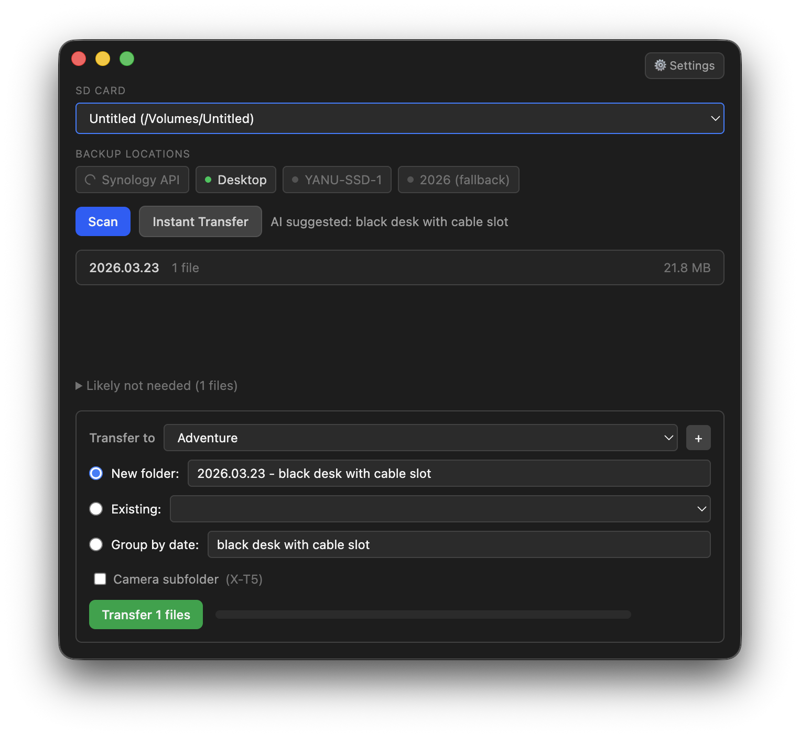

# Copier

Desktop app to check if SD card files are backed up and transfer missing ones.



## Install

```sh
brew install --cask yannickpulver/tap/copier
```

Apple Silicon only.

## Features

- Auto-detects SD cards (excludes SSDs)
- Checks against multiple sources in parallel:
  - **Synology NAS** via FileStation API (with 1Password support for credentials)
  - **Local paths** (NAS mounts, SSDs, external drives)
  - Fallback paths that only scan when NAS API is offline
- Shows missing files with size, camera model, and capture date
- Smart transfer suggestions based on where sibling files already live
- Transfer modes: new folder, existing folder, group by date
- Optional camera subfolder nesting
- Separates media files from non-media ("likely not needed")
- Click any file to reveal in Finder

## Setup

```bash
npm install
npm start
```

Click the ⚙ gear icon to configure:
- **Synology API**: host, port, user, password (supports `op://` 1Password refs)
- **Check paths**: local folders to scan (with optional "only if NAS offline" flag)
- **Transfer destination**: where to copy files

## Build

```bash
npm run make
```

Outputs to `out/make/`.

## Tech

Electron + TypeScript + Tailwind CSS + Vite
