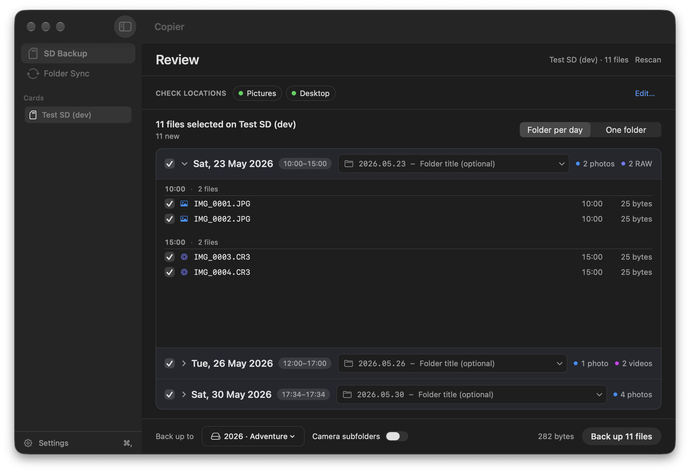

# Copier

Desktop app to check if SD card files are backed up and transfer missing ones.



## Install

```sh
brew install --cask yannickpulver/tap/copier
```

Universal binary (Apple Silicon and Intel), requires macOS 26 (Tahoe) or later.

## Features

- Auto-detects SD cards (excludes SSDs)
- Checks against multiple sources in parallel:
  - **Synology NAS** via FileStation API (with 1Password support for credentials)
  - **Local paths** (NAS mounts, SSDs, external drives)
  - Fallback paths that only scan when NAS API is offline
- Shows missing files with size, camera model, and capture date
- Smart transfer suggestions based on where sibling files already live
- Transfer modes: new folder, existing folder, group by date
- Optional camera subfolder nesting
- Separates media files from non-media ("likely not needed")
- Click any file to reveal in Finder

## Build

The app is a Tuist-generated Xcode project at `macos/`, with core logic in the `macos/CopierCore` Swift package.

```bash
cd macos && tuist generate --no-open
```

Then build with Xcode (scheme `Copier`), or from the command line:

```bash
xcodebuild -workspace macos/Copier.xcworkspace -scheme Copier build
```

## Test

```bash
cd macos/CopierCore && swift test
```

Debug builds show `dev-fixtures/test-sd` as a card. Generate it with `node scripts/make-test-sd.mjs`.

## Tech

Swift + SwiftUI, project managed with Tuist.
